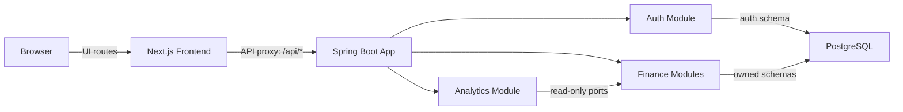
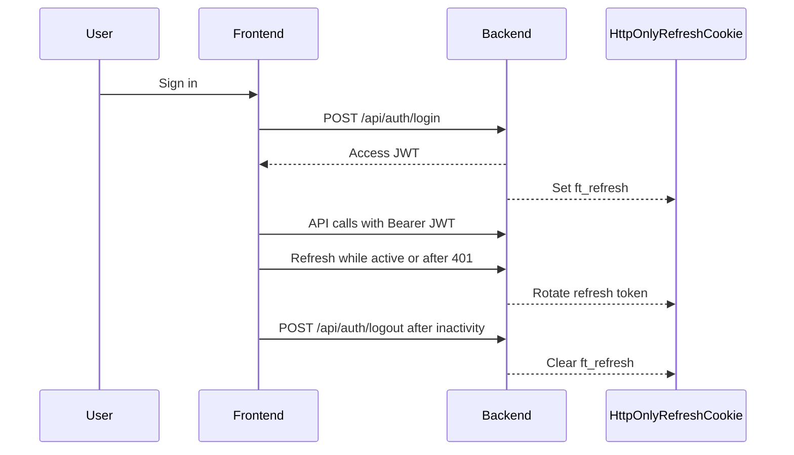

# Finance Tracker

Finance Tracker is a personal finance tracking system built as a monorepo. It combines a Kotlin/Spring Boot backend with a Next.js frontend to manage institutions, accounts, transactions, profile preferences, and portfolio analytics.

The project is designed around secure authenticated usage, feature-oriented frontend slices, and backend bounded contexts with strict module ownership.

## What It Does

- Manage financial institutions, accounts, and transaction history.
- Track portfolio KPIs, account breakdowns, and analytics views.
- Support profile preferences such as preferred currency and display language.
- Provide authentication flows for login, registration, password reset, refresh-token rotation, and strict inactivity logout.
- Keep backend modules isolated by domain while exposing a single application API.

For the live implementation inventory, test coverage, known limitations, and backlog, see [`ai-context/current-state.md`](ai-context/current-state.md).

## Architecture At A Glance



Backend modules follow Hexagonal Architecture: pure domain models and repository ports, application use cases, and infrastructure adapters/controllers. Frontend code follows Next.js App Router with feature-local API and hook modules.

More detail lives in [`ai-context/architecture.md`](ai-context/architecture.md).

## Session And Auth Flow



Access JWTs and refresh cookies are short-lived by default. Authenticated pages enforce a 10-minute wall-clock inactivity timeout with a final 15-second warning.

## Tech Stack

### Backend

- Kotlin, Spring Boot, Spring WebMVC, Spring Data JPA, Spring Security
- PostgreSQL with Flyway migrations per module schema
- JWT authentication, BCrypt password hashing, refresh-token rotation
- JUnit Jupiter, Testcontainers, Kover
- Gradle wrapper and version catalog

### Frontend

- Next.js App Router, React, TypeScript strict mode
- SWR for data fetching
- CSS Modules and local shared UI primitives
- Jest, React Testing Library, Playwright
- npm only

Exact pinned versions are documented in [`ai-context/current-state.md`](ai-context/current-state.md).

## Quick Start

The project targets Windows with PowerShell as the default local shell. PostgreSQL must be reachable before starting the backend; the `dev` profile includes Flyway seed data.

### Backend

```powershell
Set-Location backend
.\gradlew.bat :app:bootRun
```

### Frontend

```powershell
Set-Location frontend
npm install
npm run dev
```

The frontend proxies `/api/*` to the backend configured by `NEXT_PUBLIC_API_URL`, defaulting to `http://localhost:8080`.

Seed credentials and environment variables are listed in [`ai-context/current-state.md`](ai-context/current-state.md#dev-seed-credentials).

## Environment

Backend environment examples are in [`backend/.env.example`](backend/.env.example). For the frontend, create a local `frontend/.env.local` when you need to override `NEXT_PUBLIC_API_URL`.

Important defaults:

- `AUTH_JWT_ACCESS_EXPIRATION_MS=600000`
- `AUTH_REFRESH_EXPIRATION_MS=600000`
- `NEXT_PUBLIC_API_URL=http://localhost:8080`

Do not commit real secrets. See [`ai-context/current-state.md`](ai-context/current-state.md#environment-variables) for the environment variable reference.

## Build And Test

### Backend

Run from the `backend/` directory:

```powershell
.\gradlew.bat build
.\gradlew.bat build -PskipIT=true
.\gradlew.bat integrationTest -PskipIT=false
.\gradlew.bat testAggregateReport
.\gradlew.bat clean build
```

Backend integration tests use Testcontainers and require Docker. Use `-PskipIT=true` when Docker is not available and you only need unit tests.

### Frontend

Run from the `frontend/` directory:

```powershell
npm run lint
npm run build
npm test
npm run test:e2e
```

Use `npm install` for local development. CI/CD should use `npm ci` only. See [`AGENTS.md`](AGENTS.md) for the npm and Gradle command policy.

## Documentation Map

- [`AGENTS.md`](AGENTS.md): local shell, npm policy, Gradle command cheatsheet.
- [`CLAUDE.md`](CLAUDE.md): execution rules, architecture constraints, STEP pipeline, monetary rules.
- [`ai-context/README.md`](ai-context/README.md): documentation ownership map.
- [`ai-context/current-state.md`](ai-context/current-state.md): implemented features, versions, test coverage, known limitations, backlog.
- [`ai-context/architecture.md`](ai-context/architecture.md): monorepo structure, flows, API mapping, database schemas.
- [`ai-context/conventions.md`](ai-context/conventions.md): naming, test layout, formatting, accessibility, error conventions.
- [`ai-context/module-rules.md`](ai-context/module-rules.md): per-module constraints and integration notes.

## Visual Assets

This README intentionally uses Mermaid diagrams rather than screenshots. Screenshots are useful for releases and demos, but they are expensive to maintain while the UI is still changing. If the UI stabilizes, add curated screenshots under `docs/screenshots/` and link them from this section.

## Current Limitations

Known limitations and next work are tracked in [`ai-context/current-state.md`](ai-context/current-state.md#known-limitations--technical-debt). Keep that file as the source of truth instead of duplicating the backlog here.
